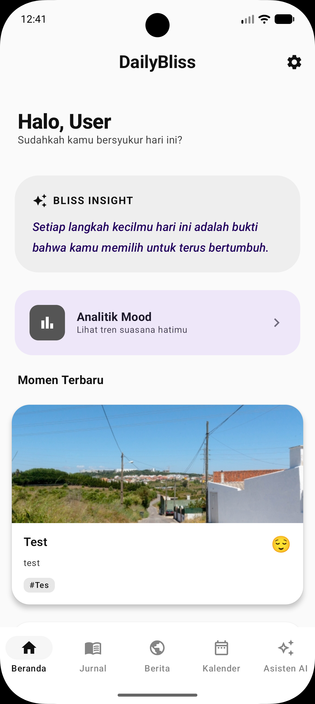
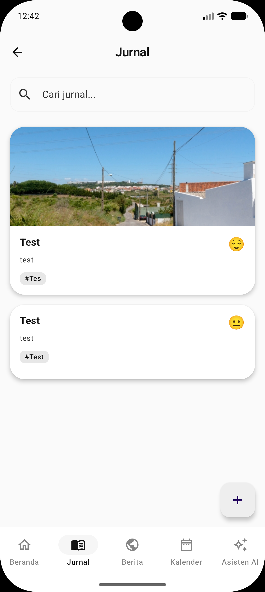
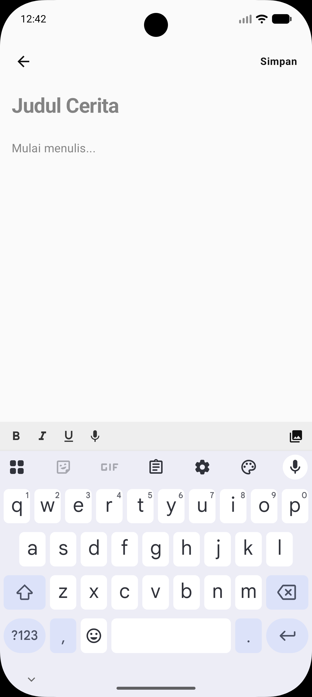
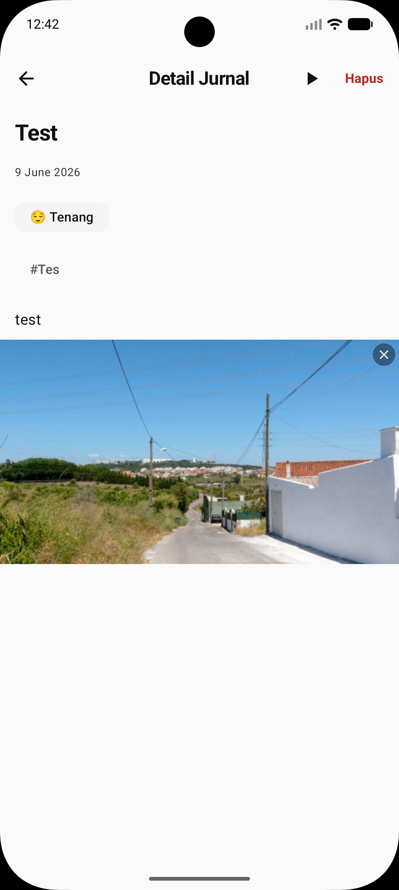
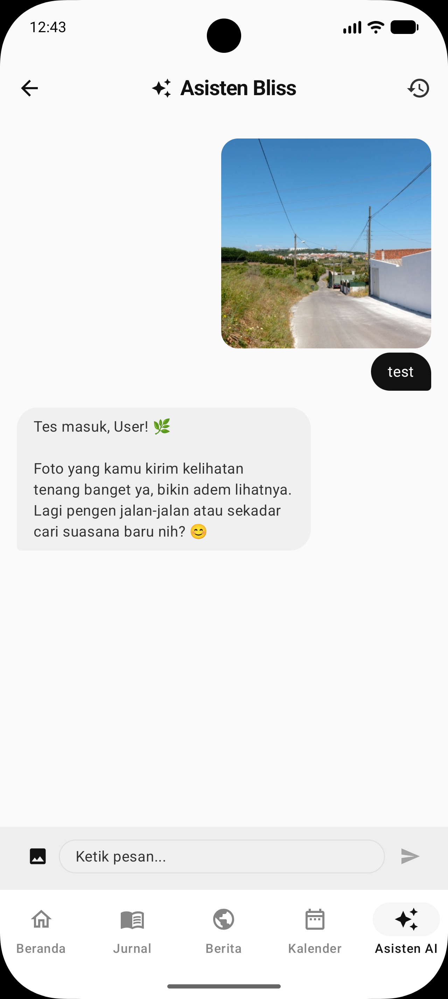
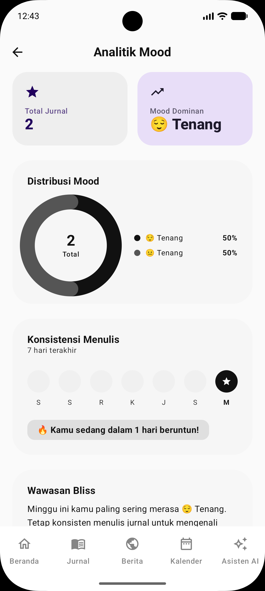
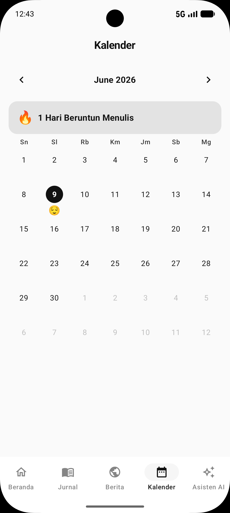
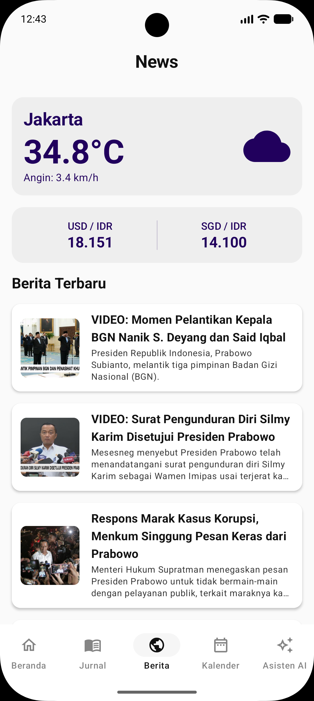
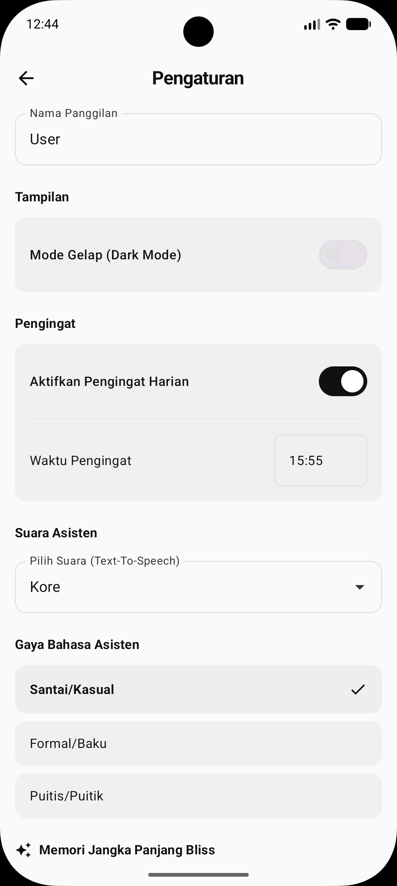

# 📱 DailyBliss - Smart AI Journaling Companion

[](https://github.com/andika-123140096/123140096-123140088-DailyBliss/actions/workflows/ci.yml)

**DailyBliss** adalah aplikasi jurnal cerdas lintas platform yang dirancang untuk membantu pengguna mengabadikan setiap momen berharga. Dengan dukungan asisten AI empatik (**Blissie**), analisis suasana hati otomatis, dan integrasi data real-time, DailyBliss mengubah aktivitas mencatat menjadi pengalaman yang reflektif dan bermakna.

Dibangun menggunakan **Kotlin Multiplatform (KMP)**, aplikasi ini menawarkan performa native yang konsisten baik di Android maupun iOS dengan satu basis kode (*Single Codebase*).

---

## 🎥 Video Demonstrasi
Tonton bagaimana DailyBliss membantu Anda mengelola jurnal dengan lebih cerdas:

[](https://youtu.be/6-4i7E7agaQ)

---

## 👥 Tim Pengembang

| Nama | NIM | Peran |
|------|-----|-------|
| **Andika Dinata** | 123140096 | Lead Developer / Architect |
| **Satria Lemana Putra** | 123140088 | UI/UX Designer / Developer |

---

## ✨ Fitur Utama

### ✍️ Pengalaman Jurnal yang Kaya
*   **Dukungan Multi-Media:** Tambahkan foto ke dalam jurnal untuk memperkaya memori Anda.
*   **Rich Text Editor:** Simpan narasi hidup Anda dengan detail yang mendalam.
*   **Offline First:** Akses dan buat jurnal kapan saja, bahkan tanpa koneksi internet.

### 🤖 Asisten AI Cerdas (Blissie)
*   **Chat Empatik:** Berinteraksi dengan Blissie yang memberikan respon tulus dan menenangkan.
*   **Analisis Suasana Hati:** Deteksi otomatis mood (Bahagia, Sedih, Tenang, dll.) dari teks jurnal.
*   **Smart Tagging:** Klasifikasi otomatis kategori jurnal (Kerja, Hobi, Keluarga) berbasis AI.
*   **Memori Jangka Panjang:** Blissie mengingat narasi hidup Anda untuk memberikan respon yang personal.

### 📊 Wawasan & Analistik
*   **Statistik Visual:** Pantau tren suasana hati melalui grafik distribusi mood yang intuitif.
*   **Daily Bliss Insight:** Dapatkan kalimat afirmasi harian yang dipersonalisasi.
*   **Flashback (On This Day):** Temukan kembali memori indah di tanggal yang sama pada tahun-tahun sebelumnya.

### 🌐 Integrasi Cerdas
*   **Cuaca Real-time:** Pantau kondisi cuaca berdasarkan lokasi Anda saat ini.
*   **Berita Global:** Feed berita terkini untuk tetap terinformasi.
*   **Pelacak Mata Uang:** Pantau nilai tukar mata uang (USD/SGD ke IDR) secara instan.

---

## 📱 Galeri Antarmuka (Screenshots)

Berikut adalah tampilan antarmuka DailyBliss yang modern dan intuitif:

### 🏠 Dashboard & Jurnal
Pusat kendali harian Anda dengan ringkasan cuaca, kutipan bijak, dan daftar momen kronologis.

| Dashboard Utama | Daftar Momen |
| :---: | :---: |
|  |  |

### ✍️ Manajemen Jurnal & Kalender
Antarmuka input yang bersih dan navigasi kalender untuk melihat histori jurnal dengan mudah.

| Tambah Jurnal | Lihat Detail Jurnal |
| :---: | :---: |
|  |  |

### 🤖 Blissie AI & Analisis
Interaksi dengan asisten AI dan visualisasi data suasana hati Anda.

| Chat AI (Blissie) | Analisis Suasana Hati (Mood) |
| :---: | :---: |
|  |  |

### 📅 Kalender & Informasi Eksternal
Akses histori melalui kalender dan integrasi berita terkini.

| Kalender | Berita Terkini |
| :---: | :---: |
|  |  |

### ⚙️ Pengaturan
Kustomisasi profil, tema, dan preferensi aplikasi.

| Pengaturan |
| :---: |
|  |

---

## 🛠️ Arsitektur & Teknologi

Aplikasi ini mengimplementasikan **Clean Architecture** dengan pemisahan layer yang tegas untuk memastikan kode yang *scalable* dan mudah diuji.

### Tech Stack
| Komponen | Teknologi |
|----------|-----------|
| **UI Framework** | Compose Multiplatform (1.7.0) |
| **Navigation** | Navigation Compose (2.8.0-alpha10) |
| **Dependency Injection** | Koin (4.0.0) |
| **Networking** | Ktor Client (3.0.1) |
| **Database** | SQLDelight (2.0.2) |
| **Local Storage** | DataStore Preferences (1.1.1) |
| **Image Loading** | Coil (3.0.4) |

---

## 🌐 Dokumentasi API

DailyBliss mengintegrasikan berbagai layanan eksternal untuk memberikan pengalaman yang kaya.

### 1. Google Gemini AI (AI Core)
Digunakan untuk asisten chat, analisis mood, dan pembuatan tag otomatis.
*   **Endpoint:** `https://generativelanguage.googleapis.com/v1beta/models/{model}:generateContent`
*   **Request Sample:**
    ```json
    {
      "contents": [{
        "parts": [{"text": "Hari ini saya merasa sangat senang karena..."}]
      }],
      "systemInstruction": { "parts": [{"text": "Kamu adalah Blissie..."}] }
    }
    ```
*   **Response Sample:**
    ```json
    {
      "candidates": [{
        "content": { "parts": [{"text": "Senang mendengarnya! Itu adalah momen yang luar biasa..."}] }
      }]
    }
    ```

### 2. Open-Meteo (Weather Data)
Memberikan informasi cuaca real-time berdasarkan koordinat pengguna.
*   **Endpoint:** `https://api.open-meteo.com/v1/forecast`
*   **Parameters:** `latitude`, `longitude`, `current=temperature_2m,wind_speed_10m`
*   **Response Sample:**
    ```json
    {
      "current": {
        "temperature_2m": 28.5,
        "wind_speed_10m": 12.4
      }
    }
    ```

### 3. Frankfurter (Currency Rates)
Menyediakan data nilai tukar mata uang terbaru.
*   **Endpoint:** `https://api.frankfurter.app/latest`
*   **Parameters:** `from=USD`, `to=IDR`
*   **Response Sample:**
    ```json
    {
      "amount": 1.0,
      "base": "USD",
      "rates": { "IDR": 15800.5 }
    }
    ```

### 4. Berita Indo (News Aggregator)
Menyajikan berita terkini dari berbagai sumber di Indonesia.
*   **Endpoint:** `https://berita-indo-api-next.vercel.app/api/cnn-news`
*   **Response Sample:**
    ```json
    {
      "data": [{
        "title": "Judul Berita",
        "contentSnippet": "Ringkasan berita...",
        "link": "https://link-berita.com",
        "image": { "small": "...", "large": "..." }
      }]
    }
    ```

### 5. IPAPI (Location Detection)
Mendeteksi lokasi pengguna berdasarkan alamat IP sebagai fallback GPS.
*   **Endpoint:** `https://ipapi.co/json/`
*   **Response Sample:**
    ```json
    {
      "latitude": -5.3971,
      "longitude": 105.2668,
      "city": "Bandar Lampung"
    }
    ```

### 6. Google Gemini TTS (Text-to-Speech)
Mengubah teks menjadi suara menggunakan model preview terbaru dari Gemini.
*   **Endpoint:** `https://generativelanguage.googleapis.com/v1beta/models/{model}:generateContent`
*   **Models:** `gemini-3.1-flash-tts-preview` (Utama), `gemini-2.5-flash-preview-tts` (Fallback)
*   **Voice Options:** `Kore`, `Aoede`, `Charon`, `Fenrir`, `Puck`
*   **Request Sample:**
    ```json
    {
      "contents": [{
        "parts": [{"text": "Halo, namaku Blissie. Senang bertemu denganmu!"}],
        "role": "user"
      }],
      "generationConfig": {
        "responseModalities": ["AUDIO"],
        "speechConfig": {
          "voiceConfig": {
            "prebuiltVoiceConfig": { "voiceName": "Kore" }
          }
        }
      }
    }
    ```
*   **Response:** Mengembalikan data audio dalam format base64 di dalam field `inlineData`.

## 🧠 Dokumentasi Sistem AI (Blissie)

DailyBliss ditenagai oleh **Blissie**, asisten AI yang dirancang bukan hanya untuk memproses data, tetapi untuk menjadi pendengar yang empatik. Blissie menggunakan model yang dikonfigurasi melalui `GEMINI_MODEL_NAME` (seperti **Gemini 1.5 Flash**) untuk memberikan respon yang cepat dan cerdas.

### 🌟 Kepribadian & Aturan Dasar
Blissie memiliki "Instruksi Sistem" (System Prompt) inti yang mendefinisikan cara ia berinteraksi:
*   **Identitas:** Blissie adalah pendamping setia yang hangat dan reflektif.
*   **Empati Utama:** Memberikan respon tulus sesuai dengan perasaan yang tertuang dalam jurnal.
*   **Personalisasi:** Menggunakan nama panggilan pengguna dan menghindari bahasa yang kaku (kecuali diminta).

### 🎭 Variasi Gaya Bahasa (AISpeechStyle)
Pengguna dapat mengubah "kepribadian" Blissie melalui menu Pengaturan. Setiap gaya memiliki panduan prompt yang unik:

| Gaya Bahasa | Karakteristik & Panduan Prompt |
| :--- | :--- |
| **Santai / Kasual** | Bahasa percakapan sehari-hari yang akrab seperti teman dekat. Menggunakan partikel seperti "banget", "kok", "sih", namun tetap sopan. |
| **Formal / Baku** | Menggunakan standar EYD yang tertata. Kalimat lengkap dan profesional, sangat cocok untuk refleksi diri yang serius dan mendalam. |
| **Puitis / Puitik** | Menggunakan diksi indah dan metafora (alam/perasaan). Fokus pada keindahan momen kecil untuk menciptakan ketenangan. |

### 🔍 Analisis & Pengolahan Data
Selain percakapan, Blissie menjalankan berbagai tugas analitik di balik layar:

*   **Mood Analysis:** Mendeteksi 7 spektrum emosi (Bahagia, Sedih, Marah, Cemas, Tenang, Bersemangat, Lelah) dan memberikan representasi emoji yang sesuai.
*   **Smart Tagging:** Mengklasifikasikan jurnal ke dalam kategori relevan (Kerja, Keluarga, Hobi, Kesehatan) secara otomatis dalam format JSON.
*   **Long-term Memory (Journal Summary):** Blissie merangkum histori jurnal pengguna menjadi narasi memori jangka panjang untuk memberikan respon yang kontekstual terhadap perkembangan hidup pengguna.
*   **Daily Bliss Insight:** Menghasilkan kalimat afirmasi atau refleksi personal (maksimal 20 kata) berdasarkan kumpulan memori pengguna untuk ditampilkan di Dashboard.

### ⚙️ Prompt Engineering & Technical Implementation
Berikut adalah instruksi teknis (literal prompts) yang di-*hardcode* dalam sistem untuk memastikan perilaku Blissie tetap konsisten:

#### 1. Core Chat System Prompt
Instruksi dasar yang membentuk kepribadian Blissie.
```text
Kamu adalah "Blissie", pendamping setia di aplikasi jurnal DailyBliss. 
Tugasmu adalah menjadi pendengar yang baik dan teman yang memberikan respon bermakna.

ATURAN DASAR:
1. Gunakan kata ganti "Aku" dan "Kamu". Hindari "Anda" atau "Saya" kecuali diminta gaya sangat formal.
2. TULIS LANGSUNG respon seolah-olah sedang berbincang tulus. Jangan gunakan label teknis.
3. Berikan empati yang tulus sesuai perasaan pengguna.
4. Tetap singkat, padat, dan tidak bertele-tele.
5. Gunakan emoji secukupnya agar terasa ramah namun tidak berlebihan.

Tujuan: Menciptakan suasana yang tenang, nyaman, dan reflektif.
```

#### 2. Speech Style Definitions
Prompt dinamis yang menyesuaikan gaya bicara berdasarkan pilihan pengguna:
*   **Santai/Kasual:** *"Gunakan bahasa percakapan sehari-hari yang akrab namun sopan. Boleh gunakan kata seperti 'banget', 'kok', 'sih'. Hindari bahasa yang terlalu alay/lebay. Anggap pengguna adalah teman dekat."*
*   **Formal/Baku:** *"Gunakan kosakata bahasa Indonesia yang standar (EYD). Gunakan kalimat yang lengkap dan tertata. Tetap hangat, tapi pertahankan profesionalisme."*
*   **Puitis/Puitik:** *"Gunakan diksi yang indah, lembut, dan penuh makna. Gunakan sedikit metafora alam atau perasaan. Fokus pada ketenangan dan keindahan momen kecil."*

#### 3. Mood & Analytics Prompts
```text
Mood Analysis:
"Analisis suasana hati dari teks jurnal berikut. Berikan jawaban dalam format JSON sederhana: {"mood": "NamaMood", "emoji": "😊"}. Pilihan mood: Bahagia, Sedih, Marah, Cemas, Tenang, Bersemangat, Lelah."

Tag Generation:
"Berikan maksimal 3 tag yang relevan. Format JSON: {"tags": ["tag1", "tag2", "tag3"]}. Tag harus singkat, satu kata, dan mencerminkan topik utama (Kerja, Keluarga, Hobi, dll)."

Daily Insight:
"Buatlah satu kalimat refleksi atau afirmasi yang sangat singkat (max 20 kata), padat, dan insightful dari kumpulan teks jurnal pengguna. Harus terasa personal dan hangat."
```

#### 4. Long-term Memory (Journal Summary)
```text
Buatlah ringkasan singkat, padat, dan Insightful dari kumpulan teks jurnal pengguna berikut.
Fokus pada:
1. Topik atau kejadian utama yang sering muncul.
2. Perkembangan emosi atau suasana hati secara umum.
3. Hal-hal penting yang perlu diingat tentang kehidupan pengguna.

Tujuan ringkasan ini adalah sebagai 'memori jangka panjang' bagi asisten AI agar bisa memberikan respon yang lebih personal.
```

## 💾 Strategi Caching & Persistensi Data

DailyBliss mengusung prinsip **Offline-First** untuk memastikan pengguna tetap dapat mengakses memori mereka kapan saja tanpa ketergantungan penuh pada internet.

### 1. SQLDelight (Local Database)
Digunakan sebagai penyimpanan utama data terstruktur:
*   **MomentEntity:** Menyimpan seluruh data jurnal secara permanen, termasuk path gambar lokal, kategori, dan metadata mood hasil analisis AI.
*   **NewsCache:** Mekanisme caching untuk data berita dan cuaca dengan masa berlaku (TTL) tertentu untuk mengurangi beban request API.

### 2. DataStore Preferences
Digunakan untuk menyimpan preferensi pengguna yang bersifat ringan:
*   Profil pengguna (Nama Panggilan).
*   Pengaturan Tema (Dark/Light mode).
*   Gaya Bahasa AI (Casual, Formal, Poetic).
*   Metadata Memori Jangka Panjang (Ringkasan Jurnal) untuk Blissie.

### 3. Coil Image Caching
Optimalisasi pemuatan gambar melalui dua lapis cache:
*   **Memory Cache:** Akses instan untuk gambar yang baru saja dilihat.
*   **Disk Cache:** Menyimpan gambar secara fisik di penyimpanan perangkat agar tidak perlu diunduh ulang.

### 4. Background AI Processing
Sistem melakukan sinkronisasi dan pembaruan "Memori Jangka Panjang" secara berkala di *background thread* untuk memastikan asisten AI selalu memiliki konteks terbaru tanpa mengganggu performa UI.

---

## 🚀 Cara Menjalankan Proyek

### 1. Prasyarat
*   Android Studio Ladybug atau versi terbaru.
*   JDK 17.
*   Xcode (untuk menjalankan target iOS).

### 2. Konfigurasi API Key
Buat file `local.properties` di root project dan tambahkan API Key dari [Google AI Studio](https://aistudio.google.com/):
```properties
GEMINI_API_KEY=YOUR_API_KEY_HERE
GEMINI_MODEL_NAME=gemini-1.5-flash
```

### 3. iOS Setup
Pastikan permission berikut dikonfigurasi di `Info.plist`:
*   `NSCameraUsageDescription` (Akses Kamera)
*   `NSPhotoLibraryUsageDescription` (Akses Galeri)
*   `NSLocationWhenInUseUsageDescription` (Akses Lokasi)

## 📄 Lisensi
Proyek ini dilisensikan di bawah **MIT License**.

---
*Dikembangkan dengan ❤️ oleh Tim DailyBliss untuk Mata Kuliah Pengembangan Aplikasi Mobile - ITERA.*
